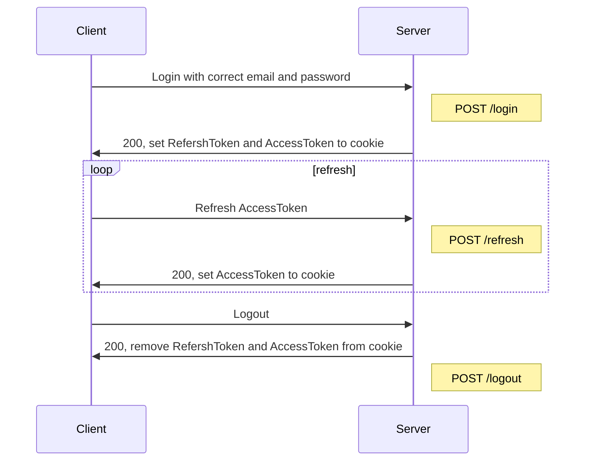
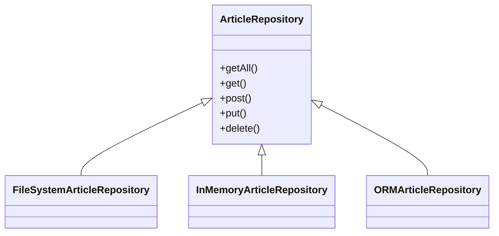

# README

## Getting Started

```sh
$ npm ci
```

## Environment Variables

```sh
$ echo "ACCESS_TOKEN_SECRET=SHHHH" >> .env
$ echo "REFRESH_TOKEN_SECRET=SHHHHHHHHH" >> .env
```

## Run Locally

```sh
$ node --env-file .env main.ts
```

## Architectures

### Sequence Diagrams

#### Login/logout



### Class Diagramss

#### Dependency Inversion of Data Source


