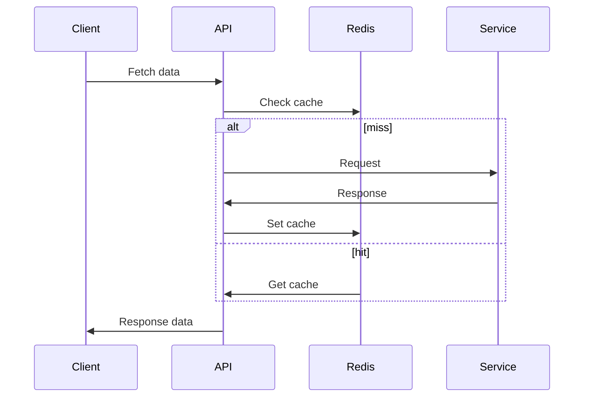

# README

## Flow



## Getting Started

```sh
$ npm ci
```

## Environment Variables

```sh
$ touch .env
$ echo "VISUAL_CROSSING_WEB_SERVICES_KEY=YOUR_API_KEY" >> .env
```

## Run Locally

```sh
$ docker run -p 6379:6379 -d redis:8.0-rc1
$ node --env-file .env main.ts
```

## Tests

```sh
$ npx vitest run
```
